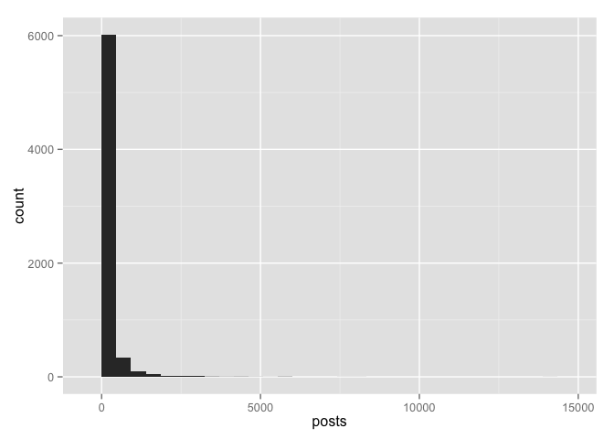
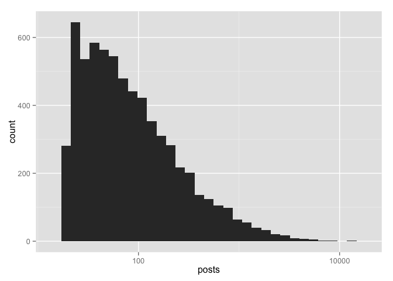
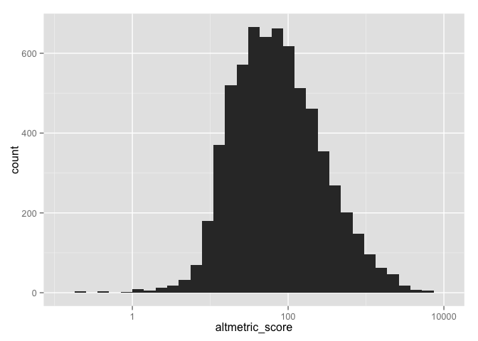
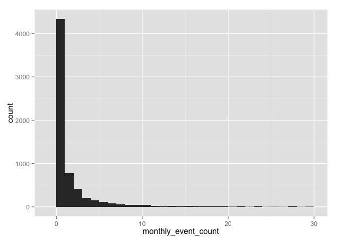
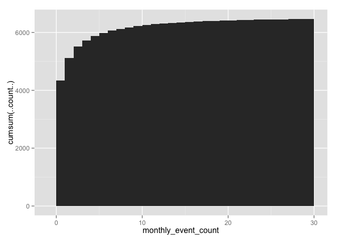
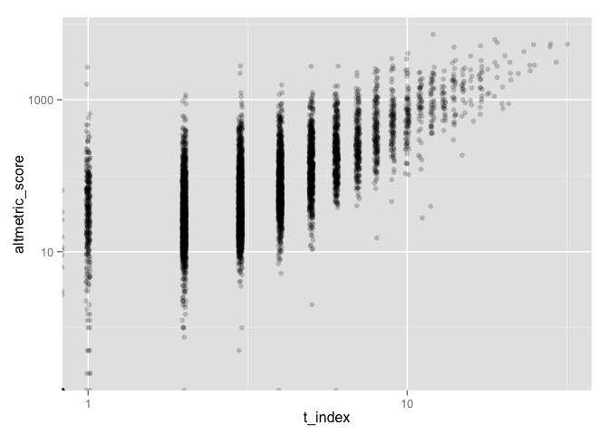

# researcher-level metrics blog post
Heather Piwowar and Jason Priem  

*This paper is still in progress. Feel free to submit a pull request with updates and changes.*


```r
# subset by >25 events ad condition the columns
profiles_bool <- profiles %>% select(-id) 
# profiles_bool <- profiles %>% select(-id) %>% select(-posts) %>% select(-accounts) 
#profiles_bool[profiles_bool>0] <- 1
#profiles_bool[1,] <- 0  # hack to make corr not explode

#corrplot(cor(profiles_bool), type='lower', order='FPC', method='color')
```


how prevelant are different kinds of success for each person (by metric)

```r
# by metric
number_of_people = nrow(profiles)
channels = profiles %>% select(blogs:wikipedia) %>% melt
```

```
## Using  as id variables
```

```r
nonzero_channels =  channels %>% filter(value>1)

nonzero_channels %>% ggplot( aes(reorder(variable, variable, length)) ) +
  geom_bar(aes(y=..count../6583)) +
  coord_flip() +
  scale_y_continuous(labels = percent) +
  ggtitle("Percentage people with research mentioned on a given channel \n(people with at least 20 mentions)") +
  ylab("Percentage of people") +
  xlab("Channel")
```

 

how prevelant are different kinds of success for each person (overall)

```r
# number of sources
profiles %>% ggplot( aes(num_sources) ) + geom_histogram(binwidth=1)
```

 

```r
profiles %>% ggplot( aes(num_sources) ) + geom_histogram(binwidth=1, aes(y=cumsum(..count..)))
```

 

```r
# number of posts
profiles %>% ggplot( aes(posts) ) + geom_histogram()
```

```
## stat_bin: binwidth defaulted to range/30. Use 'binwidth = x' to adjust this.
```

 

```r
profiles %>% ggplot( aes(posts) ) + geom_histogram() + scale_x_log10() 
```

```
## stat_bin: binwidth defaulted to range/30. Use 'binwidth = x' to adjust this.
```

 

```r
profiles$posts %>% median
```

```
## [1] 68
```

```r
# altmetric scores
profiles %>% ggplot( aes(altmetric_score) ) + geom_histogram()
```

```
## stat_bin: binwidth defaulted to range/30. Use 'binwidth = x' to adjust this.
```

 

```r
profiles %>% ggplot( aes(altmetric_score) ) + geom_histogram() + scale_x_log10() 
```

```
## stat_bin: binwidth defaulted to range/30. Use 'binwidth = x' to adjust this.
```

 

```r
profiles$altmetric_score %>% median
```

```
## [1] NA
```

```r
# altmetric scores, zoom in on the meat
profiles %>% filter(altmetric_score < 250) %>% ggplot( aes(altmetric_score) ) + geom_histogram()
```

```
## stat_bin: binwidth defaulted to range/30. Use 'binwidth = x' to adjust this.
```

 

```r
# activity, as defined by having stuff in each of the last three months
profiles %>% filter(monthly_event_count < 30) %>% ggplot( aes(monthly_event_count) ) + geom_histogram(binwidth=1)
```

 

```r
profiles %>% filter(monthly_event_count < 30) %>% ggplot( aes(monthly_event_count) ) + geom_histogram(binwidth=1, aes(y=cumsum(..count..)))
```

 

```r
# how many have monthly events at all
profiles %>% filter(monthly_event_count > 0) %>% nrow
```

```
## [1] 2247
```

```r
profiles %>% filter(monthly_event_count == 0) %>% nrow
```

```
## [1] 4336
```


lets see how counts various metrics relate to one another

First, the number of sources vs the number of posts

```r
head(profiles)
```

```
##   X                  id blogs f1000 facebook googleplus linkedin news
## 1 1 0000-0001-5018-8054     1     0        1          0        0    0
## 2 2 0000-0001-5022-1053    68     0       65         17        0  137
## 3 3 0000-0001-5026-3122    12     2       20          2        0   31
## 4 4 0000-0001-5026-5582     0     0        1          1        0    0
## 5 5 0000-0001-5028-0686     5     0        2          0        0    1
## 6 6 0000-0001-5028-9138     2     0        1          0        0    6
##   peer_reviews pinterest policy q.a reddit twitter video weibo wikipedia
## 1            0         0      0   0      0      17     0     0         1
## 2            0         0      0   0      2     704     4     6        96
## 3            0         0      1   0      2     236     0     0         6
## 4            0         0      0   0      0      18     0     0         0
## 5            0         0      0   0      1      11     0     0         7
## 6            0         0      0   0      0      18     0     0         1
##   num_sources posts altmetric_score monthly_event_count t_index
## 1           2    20           1.000                   2       1
## 2           9  1099        1535.314                  83      11
## 3           9   312         421.604                   7       6
## 4           3    20           6.850                   0       2
## 5           6    27          59.578                   0       2
## 6           5    28          74.358                   0       3
```

```r
# sources vs posts
profiles %>%  ggplot(aes(num_sources, posts))  + geom_jitter(alpha=0.5) 
```

 

```r
cor(profiles$num_sources, profiles$posts)
```

```
## [1] 0.459406
```

```r
cor(profiles$num_sources, log10(profiles$posts))
```

```
## [1] 0.7079391
```
* moderate correlation goes up noticebly when you log-transform posts


Let's look at the relationship between the altmetric score vs posts/tweets

```r
# altmetric score vs posts
profiles %>%  ggplot(aes(posts, altmetric_score))  + geom_point(alpha=.2) + scale_x_log10() + scale_y_log10()
```

```
## Warning: Removed 6 rows containing missing values (geom_point).
```

 

```r
cor(log10(profiles$altmetric_score), log10(profiles$posts), use='complete.obs')
```

```
## [1] NaN
```

```r
cor(profiles$altmetric_score, profiles$posts, use='complete.obs')  # makes no difference
```

```
## [1] 0.8235586
```

```r
# altmetric score vs twitter
profiles %>%  ggplot(aes(twitter, altmetric_score))  + geom_point(alpha=0.2) + scale_x_log10() + scale_y_log10()
```

```
## Warning: Removed 6 rows containing missing values (geom_point).
```

 

```r
cor(log10(profiles$altmetric_score), log10(profiles$twitter))
```

```
## [1] NA
```

* correlations really strong, only a bit less strong when you use tweets instead of posts.


Lets take a look at the t-index

```r
# altmetric score vs t-index
profiles %>% ggplot( aes(t_index) ) + geom_histogram(binwidth=1, aes(y=cumsum(..count..)))
```

 

```r
profiles$t_index %>% median
```

```
## [1] 3
```

```r
profiles %>%  ggplot(aes(t_index, altmetric_score))  + geom_jitter(alpha=0.2) + scale_x_log10() + scale_y_log10() 
```

```
## Warning: Removed 6 rows containing missing values (geom_point).
```

 

```r
cor(profiles$altmetric_score, profiles$t_index)
```

```
## [1] NA
```

```r
cor(log10(profiles$altmetric_score), log10(profiles$t_index))
```

```
## [1] NA
```

* everything above 800 on the graph is the top 5%, which is convenient for estimating. so t-index=12 is the top 5 percentile.
* the median of 4 suggests that we could maybe do a badge for everyone who's got a 5 or better.
* surprisingly good correlation between t-index and both altmetric score and posts count, even after log-transform


