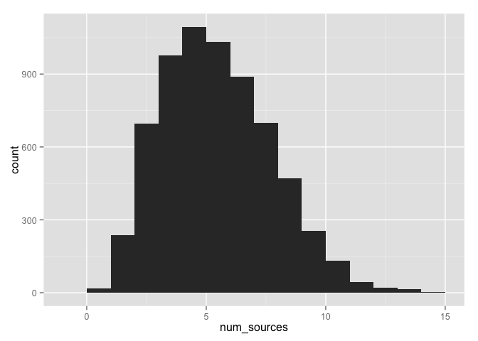
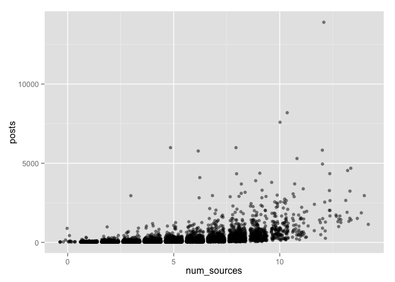
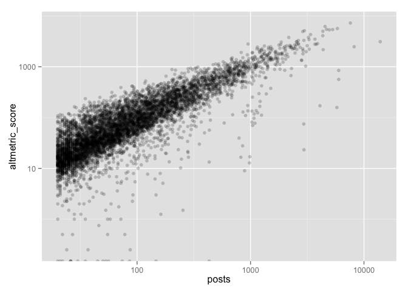
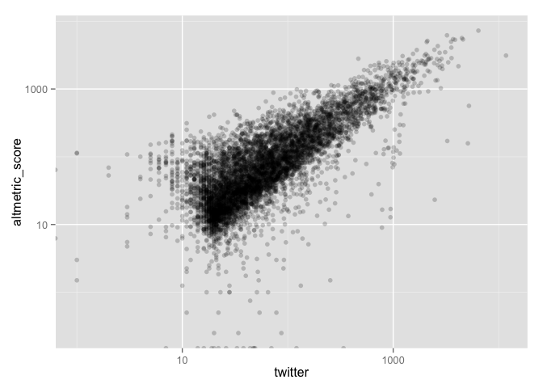

# Researcher-level altmetrics paper
Heather Piwowar and Jason Priem  

*We're presenting this paper at the [3:AM conference](http://altmetricsconference.com/schedule/) in Bucharest, 28-29 Sept 2016. Once it's a bit more polished we plan to upload it to the ArXiv. It's very much a work in progress; feel free to submit pull requests with updates and changes.*


## researcher-level altmetrics

* This section still needs its citations...*
 
There's been a lot of work examining the distribution and properties of altmetrics at the level of individual papers, and sensibly so. Since this is the lowest level of aggregation, it's a great place to start. Researchers have also looked at altmetrics by journal, following a long trend of journal-level citation bibliometrics work. However, there's surprisingly little work on altmetrics at the *researcher* level. 

And the researcher level matters. Researchers decide what to study, where to publish, and how to publish it. And they are exceedingly aware of impact metrics, and the massive affect of these metrics on their careers. So, effective and meaningful researcher-level altmetrics could powerfully impact scholarly communication.

Of course, altmetrics will take some time to become effective and meaningful. But in the meantime, it's useful to examine the distribution and character of researcher-level altmetrics, to test the potential of these metrics for real evaluation. 


## ORCID as a source for researcher-level altmetrics 
Finding data at the reseacher level is not simple, since many commercial researcher databases like Google Scholar (shamefully) prohibit systematic analysis of their data. However, the growth of the ORCID ID system gives us an opportunity to study and open dataset of scholars and their publications. And the [2015 ORCID public data file](https://figshare.com/articles/ORCID_Public_Data_File_2015/1582705) is available for download and re-use.

Using ORCID profiles does have some difficulties. Unlike systems such as Google Scholar, ORCID does not automatically add a users' publications. It must be done manually, and it is not a particularly user-friendly process. Because of this, most ORCIDs do not include a complete publication list. This is particularly true since most  ORCIDs are created as part of a single-signon flow for another system (an academic version of the ubiquitous "sign in with Facebook" button). These users just want an account, and have no interest in making a complete publication list.

We solved this problem by using clues in ORCID records to find users who have spent significant amounts of time editing their profiles, on the assumption that these users are likely to have assembled a relatively complete publication list. After trying several different clues, we settled on two: users were more likely to have complete publications list if they 

1. Had at least one publication with a DOI from 2015 and
2. Had added a custom URL to their homepage.

This significantly narrowed our sample from the 2015 public data file, from 1.6M to 17k:

| Total ORCID accounts          | 1.6M |
|-------------------------------|------|
| With DOIs                     | 215k |
| With 2015 DOIs                | 62k  |
| With 2015 DOIs and custom URL | 17k  |

## How much altmetrics activity to these researchers have?

To start with, let's look at the number of times each researcher's work has been mentioned on a social platform (Twitter, Facebook, etc). We'll use Altmetric.com to do this, since they do a great job of getting all this data. 

One downside of this approach is that we're only able to track mentions (Altmetic calls them "posts") of articles with DOIs (well, technically ArXiv IDs as well, but this is a very small number). That still leaves us with plenty of publications to work with though, since most publications in ORCID profiles do have DOIs *(put numbers here later).*


| number of mentions | number of profiles in sample |
|-------------------------------|------|
| Fewer than 3   | 4763 |
| 4 -19   | 5390  |
| 20-200 | 5239  |
| More than 200 | 1344 |

There are 6583 ( 39% ) of the samples profiles have more than 20 mentions. For the rest of this analysis, we'll focus on these profiles, for three reasons:

1. They are a meaningful percentage of the dataset
2. And they are a particularly interesting part of the dataset, because it gets us all the "early adopters" and then some, based on Rogers' Diffusion of Innovation framework *cite*. Moreover, our experience with Impactstory users has shown that users with more than 20 mentions are much more likely to be recommend altmetrics tools like Impactstory *link*. 
3. The higher n for each profiles gives us more statistical ability to learn about altmetrics at the person level.


## What kind of online impact are they having?

We looked at mention type by channel:


```r
# by metric
number_of_people = nrow(profiles)
channels = profiles %>% select(blogs:wikipedia) %>% melt
```

```
## Using  as id variables
```

```r
nonzero_channels =  channels %>% filter(value>1)

nonzero_channels %>% ggplot( aes(reorder(variable, variable, length)) ) +
  geom_bar(aes(y=..count../6583)) +
  coord_flip() +
  scale_y_continuous(labels = percent) +
  ggtitle("Percentage people with research mentioned on a given channel \n(people with at least 20 mentions)") +
  ylab("Percentage of people") +
  xlab("Channel")
```

 


There is a tendancy for researchers to be mentioned on a similar number of channelss: 3104 people (47%) are mentioned on 3, 4, or 5 channels:


```r
# number of sources
profiles %>% ggplot( aes(num_sources) ) + geom_histogram(binwidth=1)
```

 


## how much online impact are they having?

There are a few ways to look at the total amount of online impact each researcher is having. We'll look at three:

* counts of mentions
* source-weighted mention counts using Altmetric score
* Twitter h-index ("t-index")

### Counts of mentions
The distribution of mentions per person is, as expected, highly skewed. *(later: show log-log post because we think it is log-log distributeds)*. The median number of mentions per profile is 68.


```r
# number of posts
profiles$posts %>% median
```

```
## [1] 68
```

### Source-weighted mention counts using Altmetric score
*TODO write why weighted counts*

Like the pure counts, the weighted ones are highly skewed. However, they have an interesting property that when we log-transform the bins, we get a relatively normal-shaped distribution, which is quite useful in many contexts:

```r
# altmetric scores
profiles %>% ggplot( aes(altmetric_score) ) + geom_histogram() + scale_x_log10() 
```

```
## stat_bin: binwidth defaulted to range/30. Use 'binwidth = x' to adjust this.
```

 

#### Relationship between weighted and unweighted counts

We wondered how much additional value is being added with the weighted approach. Are we getting at truly different picture of impact this way? To look more closely at this we plotted the weighted vs unweighted mention counts:


```r
# altmetric score vs posts
profiles %>%  ggplot(aes(posts, altmetric_score))  + geom_point(alpha=.2) + scale_x_log10() + scale_y_log10()
```

```
## Warning: Removed 6 rows containing missing values (geom_point).
```

 

```r
cor(log10(profiles$altmetric_score), log10(profiles$posts), use='complete.obs')
```

```
## [1] NaN
```

```r
cor(profiles$altmetric_score, profiles$posts, use='complete.obs')  # makes no difference
```

```
## [1] 0.8235586
```

Interestingly, there is quite a bit of correlation here, suggesting that (at a high level of aggregation) maybe a simple count of mentions is giving us a lot of the information we'd get from a weighted sum. We pushed this a bit further to see if there's good correlation between simply counting the summed number of tweets per profile, and using the summed Altmetric score:


```r
# altmetric score vs twitter
profiles %>%  ggplot(aes(twitter, altmetric_score))  + geom_point(alpha=0.2) + scale_x_log10() + scale_y_log10()
```

```
## Warning: Removed 6 rows containing missing values (geom_point).
```

 

```r
cor(log10(profiles$altmetric_score), log10(profiles$twitter))
```

```
## [1] NA
```

Again, we see that there is a strong relationship. This is both because tweets make up a large part of the Altmetric score (since they are so prevelant), and because impact on different social channels tends to be fairly well-correlated as much previous research has shown *(cite)*.

### Twitter h-index ("t-index")

A downside of these person-level stats is that they don’t account for differing amounts of publications, or consistency across publications. Let's consider a t-index (Twitter-menion based h-index) which, reflects the number of publications as well as the number of mentions per publication. The definition of the t-index is that a scholar with an index of t has t publications each of which has been mentioned on twitter at least t times.

Half of our sample has a t-index of 3 or more:


```r
# altmetric score vs t-index
profiles %>% ggplot( aes(t_index) ) + geom_histogram(binwidth=1, aes(y=cumsum(..count..)))
```

 

```r
profiles$t_index %>% median
```

```
## [1] 3
```


We find the t-index correlates with tweet counts, but not that closely.


```r
profiles %>%  ggplot(aes(t_index, altmetric_score))  + geom_jitter(alpha=0.2) + scale_x_log10() + scale_y_log10() 
```

```
## Warning: Removed 6 rows containing missing values (geom_point).
```

 

## Still in progress

As you can see this is still very much a work in progress. Here's what we're still working on:

* For most people, most mentions are tweets. It will be cool to have a plot that shows this.
* We have data for the distribution of mentions over time. We need to describe this still.
* It's going to be really interesting to describe and plot the relationship between altmetric-based indicators (number of mentions, weighted mention counts, t-index) and traditional citation metrics for our sample. This has been done to death at the publication level, but not yet at person level so much.


